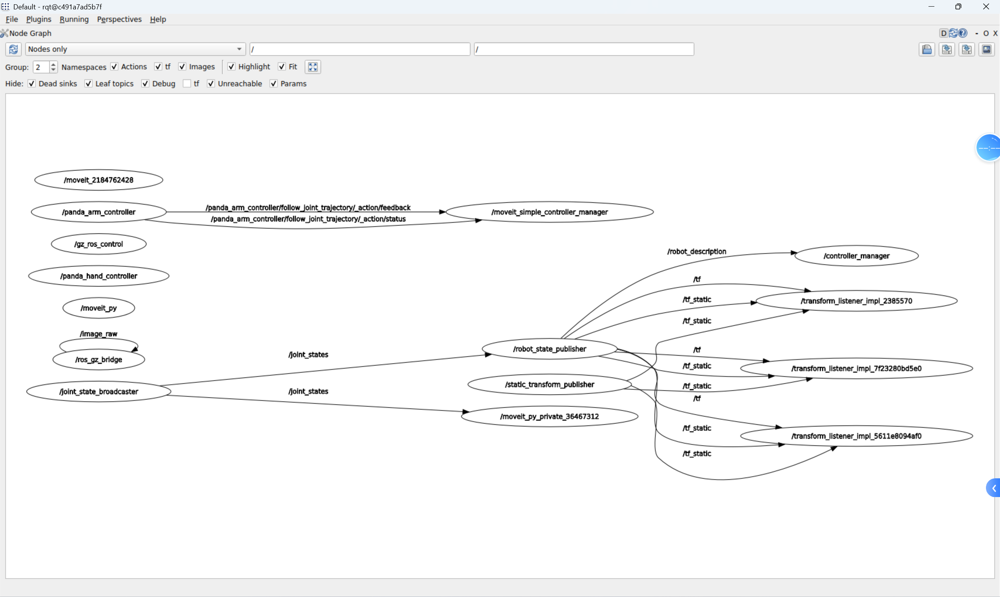
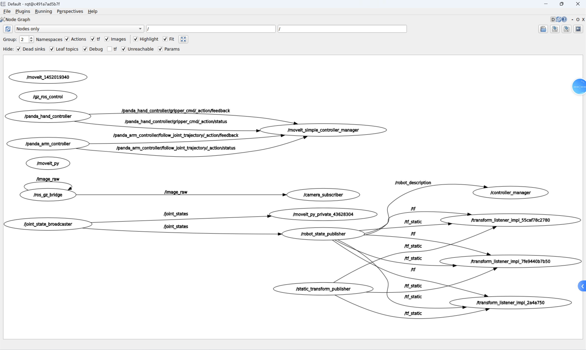
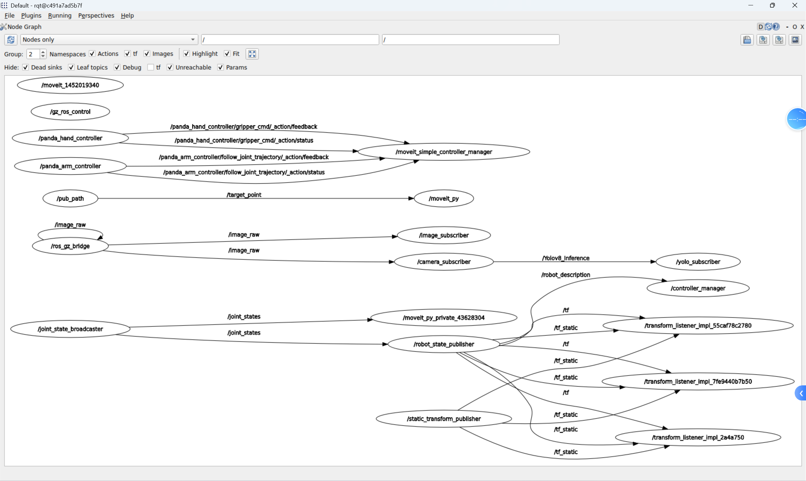

# 正常运行的节点图

🤔：拆分的launch运行后，要符合这些节点连接状态，这样才能正确通信。

❇️1、运行：`ros2 launch panda_moveit_config gazebo_obb.launch.py`

节点连接状态：

可以看到`moveit_py`节点和其他接连没有什么连接，这样单独启动影响较小。

❇️2、运行：`ros2 launch yolov8_obb yolov8_obb.launch.py`

节点连接状态：

❇️3、运行：`python3 bolt_selector.py `

节点连接状态：

