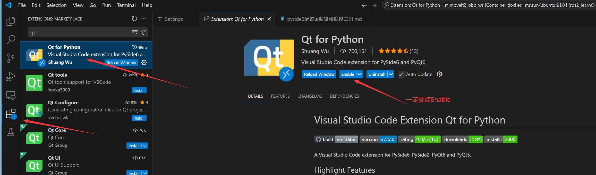
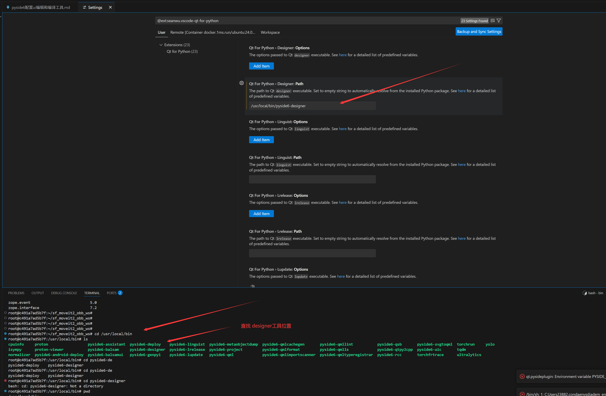
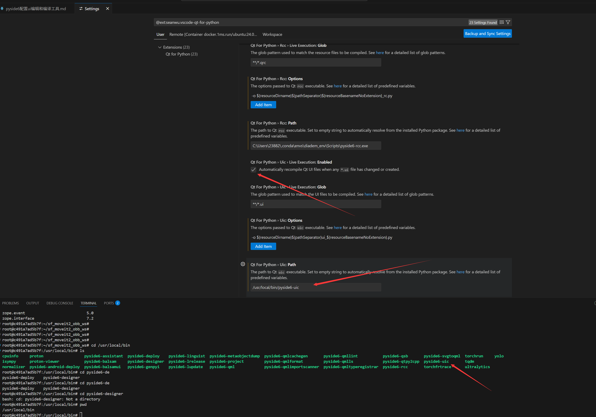
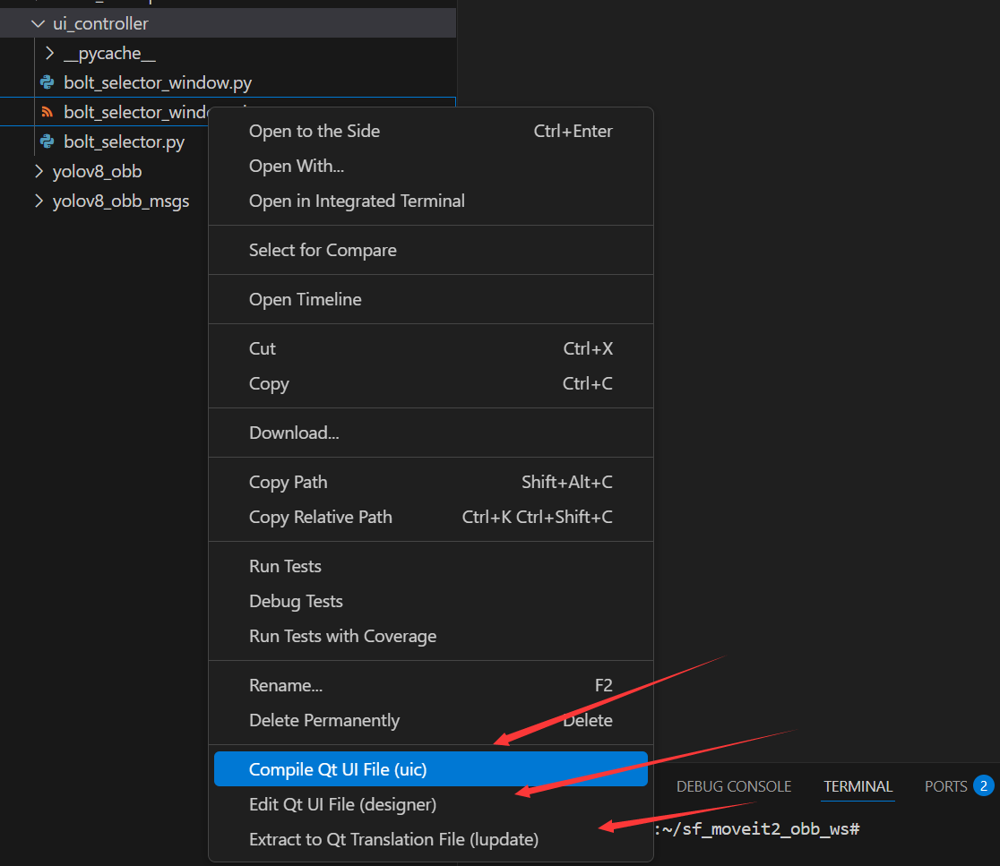
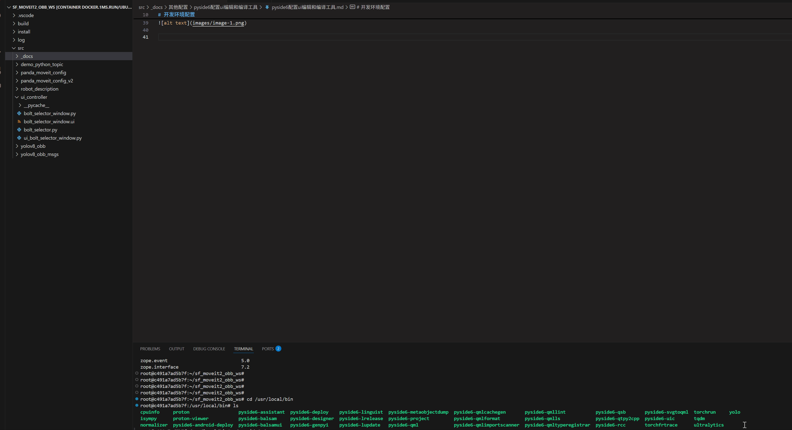

---

[TOC]

# 前言

配置pyside6的ui文件的编辑和编译工具

# 开发环境配置

1、下载插件




2、配置路径

designer路径配置



```shell
/usr/local/bin/pyside6-designer
```

配置ui编译文件路径，注意勾选自动编译ui文件



```shell
/usr/local/bin/pyside6-uic
```

3、使用方式

这样才方便编辑ui文件





当保存后，自动编译ui文件。