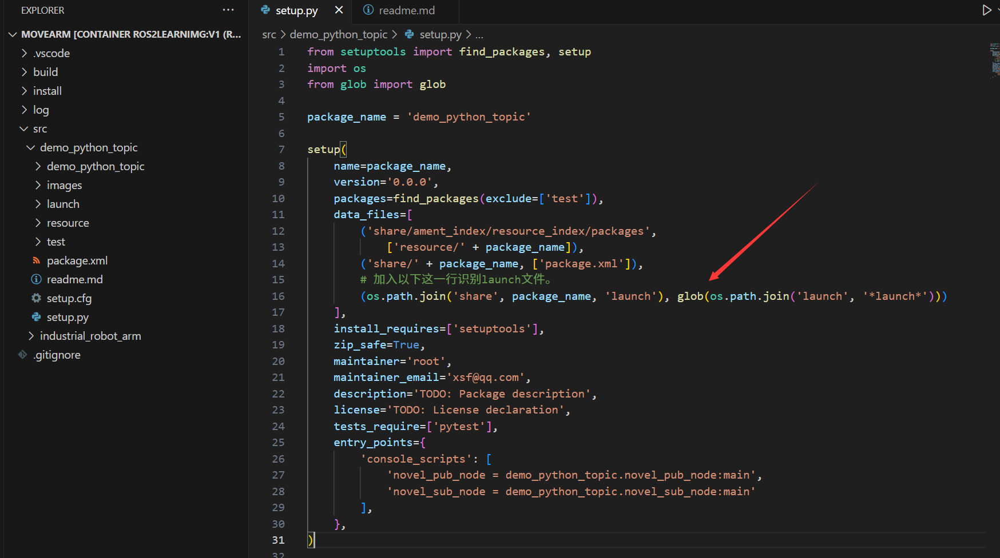
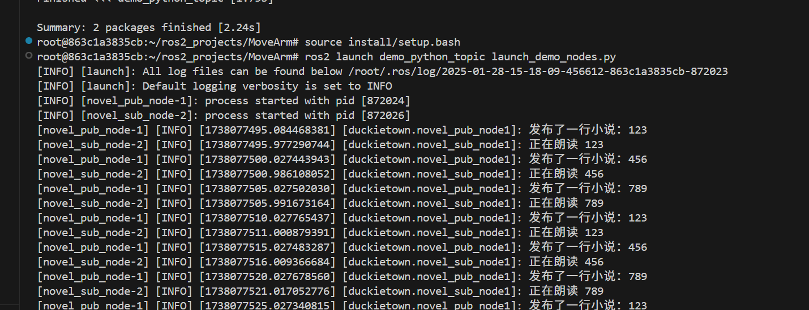

---

[TOC]

# 前言

[ ROS 2 documentation](https://ros2docs.robook.org/humble/Tutorials.html)


# 操作

❇️创建节点

```shell
cd src

ros2 pkg create demo_python_topic --node-name novel_pub_node --build-type ament_python --dependencies rclpy std_msgs

ros2 pkg create my_arm_description --build-type ament_python --dependencies rclpy std_msgs

colcon build

ros2 run demo_python_topic novel_pub_node

ros2 run demo_python_topic novel_sub_node

```

❇️终止节点

```shell
ros2 node list
ros2 node kill /your_node_name
```

❇️键盘控制节点（常用）

```shell
ros2 run teleop_twist_keyboard teleop_twist_keyboard
```

❇️查看话题

```shell
# 查看话题
ros2 topic list

# 查看话题详情
ros2 topic info /topic_name

# 查看话题信息
ros2 topic echo /topic_name
```

# 编写同时启动多节点的文件

[Launch文件的认识和使用](https://gitee.com/gwmunan/ros2/wikis/pages?sort_id=9276390&doc_id=4855084)

添加编译文件



```shell
ros2 launch demo_python_topic launch_demo_nodes.py
```




# 报错

❌

```shell
 Unable to open file "package://ur3/meshes/base_link.STL".
 ```

 ✔️

 ```shell

 ```

❌

```shell
[rviz2-3] [ERROR] [1741501928.886772548] [rviz]: Could not find parameter robot_description_semantic and did not receive robot_description_semantic via std_msgs::msg::String subscription within 10.000000 seconds.
[rviz2-3] Error:   Could not parse the SRDF XML File. Error=XML_ERROR_EMPTY_DOCUMENT ErrorID=13 (0xd) Line number=0
[rviz2-3]          at line 732 in ./src/model.cpp
[rviz2-3] [ERROR] [1741501928.891686224] [moveit_2021564851.moveit.ros.rdf_loader]: Unable to parse SRDF
[rviz2-3] [ERROR] [1741501928.917194742] [moveit_2021564851.moveit.ros.planning_scene_monitor]: Robot model not loaded
```


❌

```shell
[spawner-5] [INFO] [1741503825.059191951] [spawner_joint_state_broadcaster]: Loaded joint_state_broadcaster
[spawner-5] [ERROR] [1741503825.062084664] [spawner_joint_state_broadcaster]: Failed to configure controller
[ERROR] [spawner-5]: process has died [pid 180403, exit code 1, cmd '/opt/ros/jazzy/lib/controller_manager/spawner joint_state_broadcaster --ros-args'].
```

✔️

将urdf文件中的`velocity="100"`改为`velocity="100.0000001"`